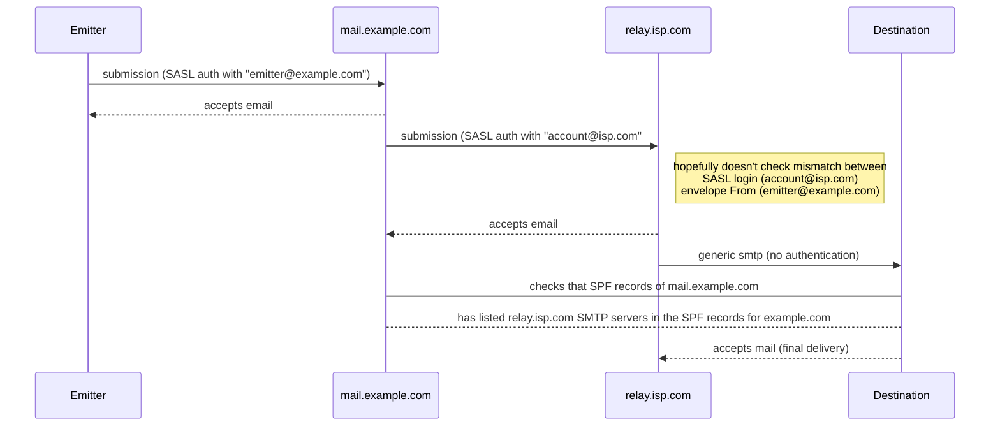

# Graphics for explaining mail transmission

These graphics use [Mermaid](https://mermaid.js.org/), but for some
reason they don't render on Github pages, but they do (as of 08/2023) on
github.com. Go figure.

## Outgoing smtp with rela

